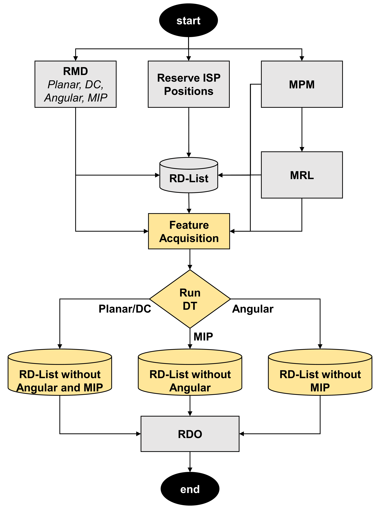

# A Machine Learning-Based Solution to Accelerate the Intra Mode Decision for the VVC Standard

This repository contains the source code of the machine-learning-based solution proposed in the paper **"A Machine Learning-Based Solution to Accelerate the Intra Mode Decision for the VVC Standard"**.

The proposed solution uses a Decision Tree to predict the most promising class of intra-prediction modes, reducing the number of mode classes that need to be fully evaluated by the rate-distortion optimization (RDO) process.

## Associated Publication

**A Machine Learning-Based Solution to Accelerate the Intra Mode Decision for the VVC Standard**

Adson Duarte, Anna Oliveira, Bruno Zatt, Guilherme Correa, and Daniel Palomino.

**Paper:** [ACM Digital Library](https://dl.acm.org/doi/abs/10.1145/3617023.3617034)

**DOI:** [10.1145/3617023.3617034](https://doi.org/10.1145/3617023.3617034)

## Abstract

The VVC video coding standard achieves high compression rates due to innovative tools that were introduced mainly in the intra prediction. However, the high computational effort associated with the intra mode decision poses a challenge for real-time video coding applications. In this paper, we propose a machine learning-based solution to accelerate the intra mode decision of VVC. The intra modes are organized in three classes (**Planar/DC, Angular and MIP**) and a Decision Tree model is developed to predict the class of modes more likely to be chosen, avoiding the evaluation of the classes of modes with less chance to be the optimal. As a result, the proposed solution can reduce the total encoding time in **15.67% on average** with only **0.80% of coding efficiency loss**. When compared with related works, our solution presents good results.

## Proposed Solution

The proposed solution organizes the VVC intra-prediction modes into three classes:

1. **Planar/DC**
2. **Angular**
3. **Matrix-based Intra Prediction (MIP)**

A **Decision Tree** model is used to predict the class of modes that is most likely to contain the optimal intra mode for a given block.

Based on the prediction, the encoder can avoid evaluating mode classes that are less likely to be selected as optimal, reducing the number of rate-distortion optimization (RDO) evaluations and, consequently, the encoding time.

<p align="center">
  
</p>

<p align="center">
  <em>Overview of the proposed machine-learning-based intra mode decision solution.</em>
</p>

## Results

The proposed solution achieves an average:

* **15.67% time saving**
* **0.80% coding efficiency loss**

The reduction in encoding time is obtained by avoiding the RDO evaluation of mode classes that are predicted to be less likely to contain the optimal intra-prediction mode.

For a detailed description of the methodology and experimental results, please refer to the associated publication.

## Software Version

This repository is based on **VTM 18.0**.

For the environment used during development and experimentation, the following configuration is recommended:

* **Operating system:** Ubuntu 20.04
* **GCC:** 9.4.0
* **CMake**
* **GNU Make**

The recommended GCC version is **9.4.0**, which is available in Ubuntu 20.04. Other operating systems, compiler versions, or configurations may work, but they have not been tested with this repository.

## Compilation

Clone this repository and enter its root directory:

```bash
git clone <repository-url>
cd <repository-directory>
```

Create a build directory:

```bash
mkdir build
cd build
```

Configure the project using CMake in Release mode:

```bash
cmake .. -DCMAKE_BUILD_TYPE=Release
```

Compile the encoder:

```bash
make -j 6
```

The `-j 6` option instructs `make` to use six parallel compilation processes. If your system has fewer available CPU cores, a smaller value can be used, for example:

```bash
make -j 4
```

or:

```bash
make -j 2
```

After compilation, the encoder executable will be available in the `bin` directory.

## Video Encoding

The compiled encoder can be used to encode a YUV video sequence using the VVC intra configuration.

For example, to encode the `RaceHorses` sequence using **QP 22**:

```bash
cd ../bin

./EncoderAppStatic \
    -c ../cfg/encoder_intra_vtm.cfg \
    -c ../cfg/per-sequence/RaceHorses.cfg \
    -q 22 \
    -i RaceHorses.yuv
```

In this example:

* `-c ../cfg/encoder_intra_vtm.cfg` specifies the VVC intra coding configuration.
* `-c ../cfg/per-sequence/RaceHorses.cfg` specifies the configuration for the `RaceHorses` sequence.
* `-q 22` specifies the **Quantization Parameter (QP)**. In this example, the encoder uses **QP 22**.
* `-i RaceHorses.yuv` specifies the input YUV video file.

The input YUV file must be accessible from the location specified by the `-i` argument. For example, if `RaceHorses.yuv` is located inside the `bin` directory, the command above can be used directly.

The QP can be changed by modifying the value passed to the `-q` argument. For example:

```bash
-q 27
```

encodes the sequence using QP 27.

## Reproducibility

To reproduce the experiments reported in the associated paper, use **VTM 18.0** together with the recommended software environment described above.

The input video sequences used in the experiments are not included in this repository. They must be obtained separately from their respective publicly available video datasets.

## Citation

If you use this code in your research, please cite the following paper:

```bibtex
@inproceedings{10.1145/3617023.3617034,
  author = {Duarte, Adson and Oliveira, Anna and Zatt, Bruno and Correa, Guilherme and Palomino, Daniel},
  title = {A Machine Learning-Based Solution to Accelerate the Intra Mode Decision for the VVC Standard},
  year = {2023},
  isbn = {9798400709081},
  publisher = {Association for Computing Machinery},
  address = {New York, NY, USA},
  url = {https://doi.org/10.1145/3617023.3617034},
  doi = {10.1145/3617023.3617034},
  booktitle = {Proceedings of the 29th Brazilian Symposium on Multimedia and the Web},
  pages = {73–81},
  numpages = {9},
  keywords = {VVC, Machine Learning, Intra Mode Decision},
  location = {Ribeir{\~a}o Preto, Brazil},
  series = {WebMedia '23}
}
```

## License

This repository contains modifications to the VVC Test Model (VTM). Please refer to the original VTM license and licensing terms applicable to the source code included in this repository.
